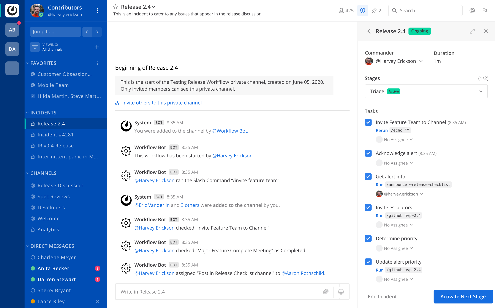

# Mattermost Incident Response Plugin

[](https://circleci.com/gh/mattermost/mattermost-plugin-incident-response)
[](https://codecov.io/gh/mattermost/mattermost-plugin-incident-response)
[](https://github.com/mattermost/mattermost-plugin-incident-response/releases/latest)

Incident Response allows your team to coordinate, manage and resolve incidents from within Mattermost.



## Features

### Plan your incidents

When an incident starts, you want to focus on triaging and solving the problem as soon as possible. Planning your incidents ahead of time with Playbooks is the best way to do it:

1. Navigate to Playbooks & Incidents in the main menu.
2. Create a new playbook, either from a predefined template or from scratch. You can add as many stages and tasks as you need. Share the playbook with the people that should decide on your processes, and select the type of channel created when an incident starts: public or private.
3. Save the playbook.

A playbook is a recipe for an incident. Plan what the responders will need to do in such situations, and make sure to schedule a post-mortem analysis to iterate on the design of your playbooks after the incident finishes. Read more about Playbooks [here](https://docs.mattermost.com/administration/devops-command-center.html#creating-a-playbook).

### Start an incident

A server in your cluster is down, a customer is unable to login or your team has detected a performance degradation. Whatever the problem is, if it needs coordination and a quick response, starting an incident will help you focus on solving it. There are two alternative ways to start an incident:

-   Write the slash command `/incident start`.
-   Click on the Incident Response icon on the channel header, which will open the RHS with a **Start Incident** button.

Either of those actions will open a dialog. Choose the playbook that best suits the incident, give it a name and an optional description and click on **Start Incident**. You will automatically jump to the channel associated with the incident, of which you are the commander now.

The RHS shows the active stage and a checklist of the tasks to do. You can assign users to the tasks (remember to add them to the channel!), run the predefined slash commands and, of course, you can message your teammates to triage and solve the incident.

Read more about Incidents [here](https://docs.mattermost.com/administration/devops-command-center.html#starting-an-incident).

### Manage your incidents

There will come a time where you will have several incidents, some of them ongoing, some ended. If you ever need a quick glance at the status of an incident, follow these steps:

1. Navigate to Playbooks & Incidents in the main menu.
2. Click on Incidents on the header.
3. See the list of all incidents. You can filter by Commander, Status (ongoing or ended) and look for a specific incident using the search box.
4. Click on the incident you are interested in.
5. A summary with some statistics of the incident will show. From this screen, you can also jump to the channel (with the button in the Messages box) and export the channel log, which will download a CSV file with a transcript of all the messages in the channel.

Read more about the Backstage here.

## Contributing

### Prerequisites

There are two things you need to do before starting development on the plugin:

1.  You will need a running server to deploy the plugin to, and the web app to manually test your changes. If you have never set up your Mattermost development environment, do so following the instructions for both the [server](https://developers.mattermost.com/contribute/server/developer-setup/) and the [web app](https://developers.mattermost.com/contribute/webapp/developer-setup/).
 2.  The plugin needs a Mattermost E20 License to start. Alternatively, you can run it for development by configuring your Mattermost server to enable both testing and developer mode. You can do so directly on the server's `config/config.json` file, setting both `ServiceSettings.EnableTesting` and `ServiceSettings.EnableDeveloper` to `true` (don't forget to restart the server afterwards). You can also configure these settings via the System Console, under Environment > Developer. See [License](#License) for more information. 

If this is the first time you contribute to a Mattermost plugin, the [plugin documentation](https://developers.mattermost.com/extend/plugins/) is a good read to go through before diving into the code.

### Set up your development environment

You have a running server and web app, and you have read the plugin documentation. Now you only need to do the usual dance: clone, cd, make.

```sh
# Change the URL below to your fork if you plan to make a PR!
git clone git@github.com:mattermost/mattermost-plugin-incident-response.git
cd mattermost-plugin-incident-response
make
```

The default target for `make` triggers the commands `check-style`, `test` and `dist`: if everything works as expected, you will end up with a packaged plugin in the `dist/` directory, ready to be uploaded to Mattermost via the System Console. There are more `make` commands: run `make help` to get a comprehensive list of them.

One particularly interesting command is `make deploy`, which looks for a running Mattermost server, and directly deploys the plugin to it and enables it via the API. For this to work, you need to set up a few environment variables before:

```sh
# This is the default URL for a local Mattermost server.
# Change it if your local instance is served elsewhere.
export MM_SERVICESETTINGS_SITEURL=http://localhost:8065

# This is the admin account created when generating sample data in the server with make test-data.
# You can change it to the credentials of any admin account.
export MM_ADMIN_USERNAME="sysadmin"
export MM_ADMIN_PASSWORD="Sys@dmin-sample1"

# You can now deploy the plugin from the comfort of your terminal!
make deploy
```

### Testing

#### Unit tests

Running the unit tests for both the server and the webapp is as easy as running

```sh
make test
```

Please note that the tests of the [`sqlstore`](server/sqlstore) package need a running server to work: they create temporal databases using the PostgreSQL and MySQL containers created by the server.

If you want to run only the tests of the server part, you may do so with the usual `go test` command, as in

```sh
# Run all server tests
go test ./server/...

# Run only the tests of the incident package
go test ./server/incident
```

If you want to run only the tests of the web app part, you may do so with `npm`:

```sh
cd webapp && npm run test
```

#### End to end tests

Our end to end (E2E) tests are implemented using [Cypress](https://docs.cypress.io/) and all of them live under the `tests-e2e/` directory. You need to install the Cypress dependencies once by doing:

```sh
cd tests-e2e
npm install
```

Running the tests successfully will require test data in the server, so make sure to generate some before running the E2E tests. To do so, do the following:

```sh
cd path/to/your/local/mattermost-server
make test-data
```

Now you are ready to run the tests from within `tests-e2e/`. There are two alternative ways:

1. run `npm test` to run all tests headlessly.
2. run `npm run cypress:open` to open the Cypress dashboard, select the test spec you want and run it.

For a full documentation on E2E tests for Mattermost web app and troubleshooting, please see https://developers.mattermost.com/contribute/webapp/end-to-end-tests/.

## License

This repository is licensed under the [Mattermost Source Available License](LICENSE) and requires a valid Enterprise E20 license. See [frequently asked questions](https://docs.mattermost.com/overview/faq.html#mattermost-source-available-license) to learn more.

Although a valid Mattermost Enterprise E20 license is required if using this plugin in production, the [Mattermost Source Available License](LICENSE) allows you to compile and test this plugin in development and testing environments without a Mattermost Enterprise E20 license. As such, we welcome community contributions to this plugin.

On startup, the plugin checks for a valid Mattermost Enterprise E20 license. If you're running the Enterprise Edition of the Mattermost server and don't already have a valid license, you can obtain a trial license from **System Console > Edition and License**. If you're running the Team Edition of the Mattermost server, including when you run the server directly from source, you may instead configure your server to enable both testing (`ServiceSettings.EnableTesting`) and developer mode (`ServiceSettings.EnableDeveloper`). These settings are not recommended in production environments.
