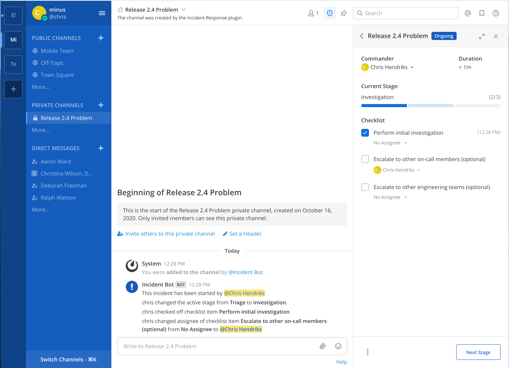

# Mattermost Incident Collaboration

 Mattermost Incident Collaboration allows your team to coordinate, manage, and resolve incidents from within Mattermost. For configuration and administration information visit our [documentation](https://docs.mattermost.com/administration/devops-command-center.html). 

## License

This repository is licensed under the [Mattermost Source Available License](LICENSE) and requires a valid Enterprise Edition E20 license when used for production. See [frequently asked questions](https://docs.mattermost.com/overview/faq.html#mattermost-source-available-license) to learn more.

Although a valid Mattermost Enterprise Edition E20 license is required if using this plugin in production, the [Mattermost Source Available License](LICENSE) allows you to compile and test this plugin in development and testing environments without a Mattermost Enterprise Edition E20 license. As such, we welcome community contributions to this plugin.

On startup, the plugin checks for a valid Mattermost Enterprise Edition E20 license. If you're running an Enterprise Edition of Mattermost and don't already have a valid license, you can obtain a trial license from **System Console > Edition and License**. If you're running the Team Edition of Mattermost, including when you run the server directly from source, you may instead configure your server to enable both testing (`ServiceSettings.EnableTesting`) and developer mode (`ServiceSettings.EnableDeveloper`). These settings are not recommended in production environments. See [Contributing](#contributing) to learn more about how to set up your development environment.

## Contributing

This plugin contains both a server and web app portion. Read our documentation about the [Developer Workflow](https://developers.mattermost.com/extend/plugins/developer-workflow/) and [Developer Setup](https://developers.mattermost.com/extend/plugins/developer-setup/) for more information about developing and extending plugins.

For more information about contributing to Mattermost, and the different ways you can contribute, see https://www.mattermost.org/contribute-to-mattermost.
