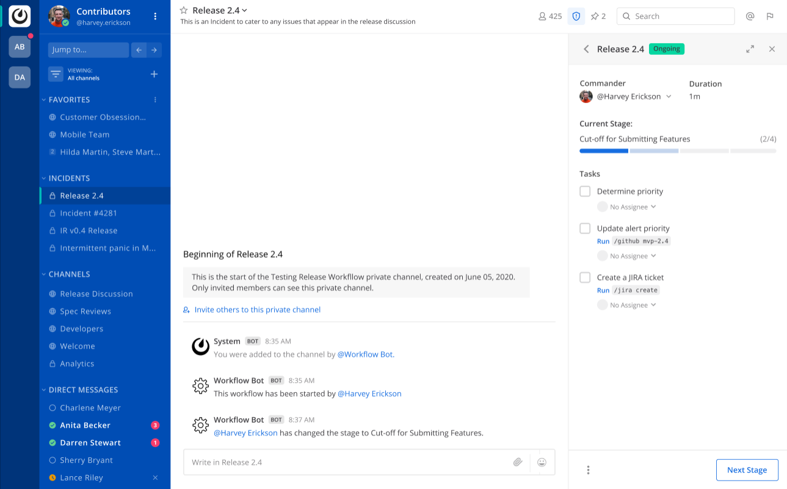

# Mattermost Playbooks

[](https://github.com/mattermost/mattermost-plugin-playbooks/releases/latest)

Mattermost Playbooks allows your team to create and run playbooks from within Mattermost. For configuration and administration information visit our [documentation](https://docs.mattermost.com/guides/playbooks.html).



## Development Builds
In your `mattermost-server` configuration (`config/config.json`), set the following values:

`ServiceSettings.EnableLocalMode: true`

`PluginSettings.EnableUploads: true`

and restart the server. Once done, the relevant `make` commands should be able to install builds. Those commands are:

`make deploy` - builds and installs the plugin a single time

`make watch` - continuously builds and installs when files change

which are run from the repo root.

## License

This repository is licensed under the Apache 2.0 License, except for the [server/enterprise](server/enterprise) directory which is licensed under the [Mattermost Source Available License](LICENSE.enterprise). See [Mattermost Source Available License](https://docs.mattermost.com/overview/faq.html#mattermost-source-available-license) to learn more.

Although a valid Mattermost Enterprise license is required to access all features if using this plugin in production, the [Mattermost Source Available License](LICENSE.txt) allows you to compile and test this plugin in development and testing environments without a Mattermost Enterprise license. As such, we welcome community contributions to this plugin.

If you're running Mattermost Starter and don't already have a valid license, you can obtain a trial license from **System Console > Edition and License**. If you're running the Team Edition of Mattermost, including when you run the server directly from source, you may instead configure your server to enable both testing (`ServiceSettings.EnableTesting`) and developer mode (`ServiceSettings.EnableDeveloper`). These settings are not recommended in production environments. See [Contributing](#contributing) to learn more about how to set up your development environment.

## Generating test data

To quickly test Mattermost Playbooks, use the following test commands to create playbook runs populated with random data:

- `/playbook test create-playbooks [total playbooks]` - Provide a number of total playbooks that will be created. The command creates one or more playbooks based on the given parameter.

  * An example command looks like: `/playbook test create-playbooks 5`

- `/playbook test create-playbook-run [playbook ID] [timestamp] [playbook run name]` - Provide the ID of an existing playbook to which the current user has access, a timestamp, and a playbook run name. The command creates an ongoing playbook run with the creation date set to the specified timestamp.

  * An example command looks like: `/playbook test create-playbook-run 6utgh6qg7p8ndeef9edc583cpc 2020-11-23 PR-Testing`

- `/playbook test bulk-data [ongoing] [ended] [days] [seed]` - Provide a number of ongoing and ended playbook runs, a number of days, and an optional random seed. The command creates the given number of ongoing and ended playbook runs, with creation dates randomly between `n` days ago and the day when the command was issued. The seed may be used to reproduce the same outcome on multiple invocations. Names are generated randomly.

  * An example command looks like: `/playbook test bulk-data 10 3 342 2`

## Running E2E tests

When running E2E tests, the local `mattermost-server` configuration may be unexpectedly modified if either `on_prem_default_config.json` or `cloud_default_default_config.json` (depending on the server edition) has conflicting values for the same keys. This can be avoided by setting `CYPRESS_developerMode=true` when calling Cypress scripts. For example: `CYPRESS_developerMode=true npm run cypress:open`.

## How to Release

To trigger a release, follow these steps:

1. **For Patch Release:** Run the following command:
    ```
    make patch
    ```
   This will release a patch change.

2. **For Minor Release:** Run the following command:
    ```
    make minor
    ```
   This will release a minor change.

3. **For Major Release:** Run the following command:
    ```
    make major
    ```
   This will release a major change.

4. **For Patch Release Candidate (RC):** Run the following command:
    ```
    make patch-rc
    ```
   This will release a patch release candidate.

5. **For Minor Release Candidate (RC):** Run the following command:
    ```
    make minor-rc
    ```
   This will release a minor release candidate.

6. **For Major Release Candidate (RC):** Run the following command:
    ```
    make major-rc
    ```
   This will release a major release candidate.


## Contributing

This plugin contains both a server and web app portion. Read our documentation about the [Developer Workflow](https://developers.mattermost.com/extend/plugins/developer-workflow/) and [Developer Setup](https://developers.mattermost.com/extend/plugins/developer-setup/) for more information about developing and extending plugins.

For more information about contributing to Mattermost, and the different ways you can contribute, see [https://www.mattermost.org/contribute-to-mattermost](https://mattermost.com/contribute/?redirect_source=mm-org).

### Logging

Logging should use the logrus package (not `pluginAPI.Log`, `mlog`, or `log`). The standard logger is automatically wired into the pluginAPI and proxied through the server:

```go
logger := logrus.WithField("playbook_run_id", playbookRunID)

err := findUserForPlaybookRunAndTeam(playbookRunID, userID, teamID)
if err != nil {
    logrus.WithError(err).WithFields(logrus.Fields{
        "user_id": userID,
        "team_id": teamID,
    }).Warn("Failed to find user for playbook run and team")
}
```

A few guidelines when logging:
* Use the appropriate level:
  * Error: an error log should require some human action to fix something upon receipt
  * Warn: a warning log might require investigation if it occurs in bulk, but does not require human action
  * Info: a information log provides context that will typically be logged by default
  * Debug: a debug log provides context that will typically be logged only on demand
* Write static log messages (`Failed to find user for playbook run and team`) instead of interpolating parameters into the log message itself (`Failed to find user %s for playbook run %s and team %s`)
* Use snake case when naming fields. Try to name these fields consistently with other usage.
* Pass errors using `WithError`.
* Use `WithFields` when passing more than one field that is not an `err`.
* Common fields can be set once instead of being passed for every log

### DB Migrations

DB migrations should be placed in `sqlstore/migrations.go` as they are the ones being run at the moment.

After transitioning to a new migration schema, the `sqlstore/migrations/future` folder will be utilised.
It would ease the transition if migrations are also added there for both drivers (mysql, postgres).
All migrations in the `future` folder should have both migration directions - `up` and `down`.

## Popular searches for Help Wanted issues:

* [Help wanted tickets currently up for grab]([https://github.com/mattermost/mattermost-server/issues?q=is%3Aopen+is%3Aissue+label%3AArea%2FPlaybooks+label%3A%22Up+For+Grabs%22](https://github.com/mattermost/mattermost-plugin-playbooks/issues?q=is%3Aopen+is%3Aissue+label%3A%22Help+Wanted%22+label%3A%22Up+For+Grabs%22))
* [Good first issue tickets]([https://github.com/mattermost/mattermost-server/issues?q=is%3Aopen+is%3Aissue+label%3AArea%2FPlaybooks+label%3A%22Good+First+Issue%22+label%3A%22Up+For+Grabs%22](https://github.com/mattermost/mattermost-plugin-playbooks/issues?q=is%3Aopen+is%3Aissue+label%3A%22Good+First+Issue%22))

For more information, join the discussion in the [`Developers: Playbooks` channel](https://community.mattermost.com/core/channels/developers-playbooks).
