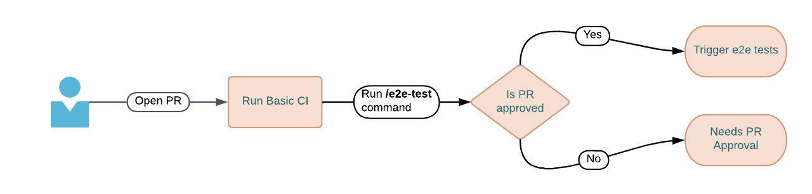

# Use /e2e-test command to execute cypress integration tests

Date: **2023-01-17**  
Status: **Under Discussion**

Contents:

- [Context](#context)
- [Decision](#decision)
- [Implementation](#implementation)
- [Notes](#notes)

## Context

Following our initiative to deprecate CirleCI in favor of Github Actions we are also trying to reduce costs in the process.  
Analyzing our pipelines we figured out that integration tests take too much time and are resource hungry. We want to introduce a new process to mitigate the cost and provide a more user friendly developer experience. 


## Decision

We want to introduce a custom PR command `/e2e-test` in order to manually trigger integration tests. The idea is similar to mattermod command introduced [here](https://github.com/mattermost/mattermost-mattermod/pull/327). The proposal includes limiting the e2e testing only on approved PRs to avoid community increased load . 



## Implementation

In order to avoid unexessary coding we can use Github Actions built in functionality to take action based on PR comments . No need to increase complexity by adding functionality on our bots . A simple example will be as below :

```yaml
name: Trigger on PR Comment
on:
  issue_comment:                                     
    types: 
      - created
jobs:
  e2e-test:
    # Check if the comments originate from pull request (because Issues and PRs have the same API)
    # Check that comment starts with /e2e-test
    if: ${{ github.event.issue.pull_request && startsWith(github.event.comment.body, '/e2e-test') }}
    runs-on: ubuntu-latest
    steps:
      - name: ci/integration-tests
        run: echo "Let's execute some integration tests"
```

## Notes

- Further parameterization can be introduced with flags on the comment body
- Developers can change the functionality easily on the same repo without extra code