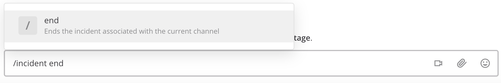
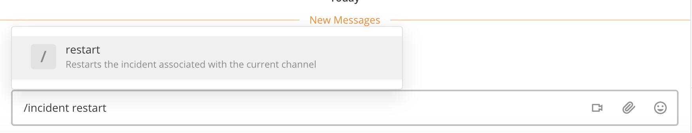

# Ending an Incident

Incident members can end an incident using the slash command `/incident end` from within the incident channel. Ending an incident signals to all participants that the issue has been resolved.

An ended incident can be restarted at any time using `/incident restart` from within the incident channel or with the **Restart Incident** button in the RHS.

Some playbooks may define stages and tasks to complete after an incident has been resolved, such as scheduling and completing a post-mortem.
