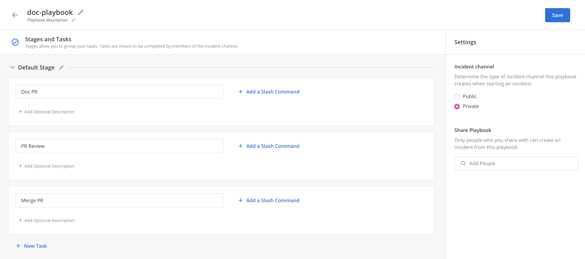
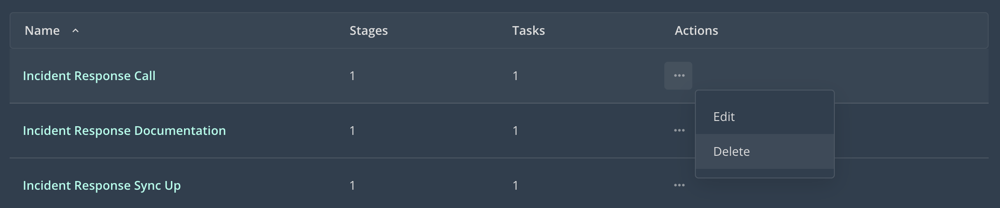

## What are playbooks?

A playbook is a recipe for dealing with and resolving an incident. In a playbook, you can plan ahead so that during an incident responders know exactly what to do. Make sure to schedule a retrospective analysis to iterate on the design of your playbooks after the incident finishes.

Within each playbook, you can create stages and tasks to ensure that items are addressed and completed in sequential order. The tasks can optionally be associated with slash commands and assigned to individual team members.

## Creating a playbook

A playbook must be defined before starting an incident.

1. Navigate to **Main Menu > Playbooks & Incidents**.
2. Select a template, or **+ Create a Playbook** to start a new playbook from scratch.
4. Name your playbook.
5. Edit the **Default Stage**, defining one or more steps to be taken by members of the incident.
   * Optionally use descriptions on steps to add additional context for members of the incident. Descriptions support a limited form of markdown, including text styling and hyperlinks.
   * Optionally define a slash command with the step, simplifying the completion of steps in the incident.
6. Configure whether the incident channel should be public or private within the team.
7. Share this playbook with other members of the team to allow them to use the playbook to start an incident, as well as edit the contents.

## Editing a playbook

You can edit a playbook at any time. However, the changes will only be applied to future incidents - not the active incidents, or incidents that previously used that playbook.

Navigate to **Main Menu > Playbooks & Incidents** and select the playbook you'd like to edit. You can:

- Change the channel type created with this playbook.
- Share the playbook.
- Delete a stage and its associated tasks.
- Add new tasks to an existing stage.
- Edit tasks in an existing stage.
- Edit the slash commands in existing tasks.
- Add new stages and tasks.

## Deleting a playbook

1. Navigate to **Main Menu > Playbooks & Incidents**.
2. Select the **Action** menu next to the playbook name.
3. Select **Delete**.
4. Confirm that you want to **Delete Playbook**.

